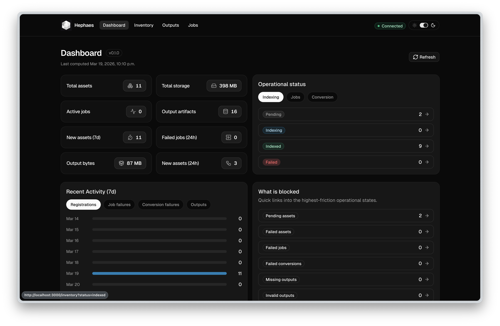

# Hephaes



Hephaes is a local-first open-source robotics log indexing and dataset conversion stack,
built to turn raw ROS and MCAP logs into clean, searchable, reproducible datasets on
your own machine.

## Core Workflow

- register local `.bag` and `.mcap` logs by file path, upload, native file picker, or directory scan
- index logs to extract duration, start and end time, topic summaries, message counts, sensor types, and raw metadata
- browse assets in a sortable/filterable inventory with tags and indexing status
- inspect each asset in a detail page with topic breakdowns, replay readiness, related jobs, and conversion history
- convert selected sessions to Parquet or TFRecord with custom mappings, compression, resampling, and manifests
- browse generated outputs and open artifact content directly
- track durable jobs for indexing, conversion, and visualization preparation
- prepare local replay and visualization artifacts for indexed assets

## Enterprise Features

We are also building features for enterprise that sit on top of the local OSS core.

Planned enterprise features include:

- cloud ingestion from buckets, remote URLs, and managed connectors
- multi-user authentication, organizations, workspaces, roles, and ownership
- shared catalogs with team-wide browsing and admin views
- saved searches, shared presets, and richer metadata search
- managed conversion jobs with retries, scheduling, and distributed execution
- first-class named datasets with versioning, sharing, approvals, and publishing
- dataset lineage with hashes, creators, schema governance, and audit history
- remote replay and visualization with access control and collaboration
- team workflows for outputs, approvals, integrations, and downstream compute actions

If you are interested in being a design partner, please reach out to hello@hephaes.ai 

## Repository Layout

- `frontend/`: the Next.js UI
- `backend/`: the FastAPI service
- `hephaes/`: the shared Python package
- `docs/`: project documentation site (Nextra)

## Python Setup

Install both Python projects for local development from the repository root:

```bash
python -m pip install -r requirements.txt
```

Or install them individually:

```bash
python -m pip install -e "./hephaes[dev]"
python -m pip install -e "./backend[dev]"
```

## Package Authoring Workflow

The `hephaes` Python package now owns the full local conversion authoring workflow:

1. inspect a registered asset
2. create a draft conversion spec
3. preview the draft
4. confirm the draft
5. save the confirmed draft as a reusable config
6. run conversions from that saved config later

### Recommended Paths

- humans: use the interactive wizard
- automation and tests: use the scriptable `drafts` commands

Wizard path:

```bash
hephaes init ./demo
hephaes add --workspace ./demo ./logs/run_001.mcap
hephaes drafts wizard --workspace ./demo <asset-id>
```

Scriptable path:

```bash
hephaes drafts create --workspace ./demo <asset-id> --topic /camera --trigger-topic /camera
hephaes drafts preview --workspace ./demo <draft-id> --sample-n 5
hephaes drafts confirm --workspace ./demo <draft-id> --yes
hephaes drafts save-config --workspace ./demo <draft-id> --name camera-demo
hephaes convert --workspace ./demo <asset-id> --config camera-demo
```

### Package Layers

- `hephaes.conversion`: stateless helpers such as `inspect_reader(...)`, `build_draft_conversion_spec(...)`, and `preview_conversion_spec(...)`
- `hephaes.workspace.Workspace`: durable local workflow methods such as `create_conversion_draft(...)`, `preview_conversion_draft(...)`, `confirm_conversion_draft(...)`, and `save_conversion_config_from_draft(...)`
- CLI commands: thin adapters over `Workspace`, including both `drafts ...` and `drafts wizard`

### Migration Notes

Existing workspace draft records are upgraded automatically when an older workspace is opened.
Legacy draft revision rows are migrated into the draft-head model used by the current package workflow.
