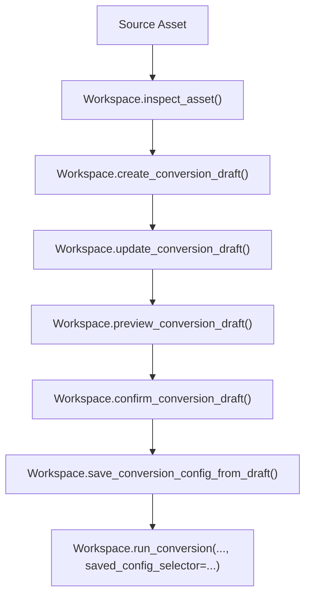

# CLI-First Authoring Architecture

## Goal

Make `hephaes` fully own the conversion authoring workflow as a local package and CLI:

1. select a source asset
2. inspect that asset
3. create a draft conversion spec from inspection
4. revise and confirm that draft
5. preview the confirmed draft against the source asset
6. save the confirmed draft as a reusable conversion config
7. run future conversions from that saved config

The package must be usable end-to-end without any backend. A future backend should be able to call the same package-owned services rather than reimplementing them.

## Problem To Fix

Today the package has the underlying pieces, but not a coherent workflow boundary:

- inspection exists as a pure helper
- draft generation exists as a pure helper
- preview exists as a pure helper
- draft persistence exists, but only as loose revision rows
- config persistence exists, but not as promotion from a confirmed draft
- the CLI can inspect and convert, but it cannot complete the full authoring lifecycle

The main gap is that `Workspace` does not yet own authoring orchestration as a first-class workflow.

## Design Principles

### Package owns business logic

`hephaes` should own:

- authoring orchestration
- durable draft lifecycle
- saved config lifecycle
- CLI workflow commands

Adapters outside the package should only translate requests and responses.

### `Workspace` remains the public durable boundary

The public local-app entry point remains `Workspace`. Stateless conversion helpers stay in `hephaes.conversion`, but durable workflow methods live on `Workspace`.

### Pure helpers stay pure

These modules remain computation-focused and reusable:

- `hephaes.conversion.introspection`
- `hephaes.conversion.draft_spec`
- `hephaes.conversion.preview`
- `hephaes.conversion.spec_io`

They should not gain CLI or storage concerns.

### Drafts are logical entities, not just rows

A draft needs:

- a stable draft id
- a current revision
- an explicit lifecycle state
- a promotion path to a saved config

The current model stores revision rows, but it does not model the draft itself.

### CLI is a thin package adapter

The CLI should only:

- parse arguments
- prompt for confirmation when requested
- call `Workspace`
- print human-readable or JSON output

The CLI should not own workflow rules.

## Target Workflow



## Public Package Surface

### Existing pure models to reuse

Where possible, reuse existing package models instead of inventing backend-specific copies:

- `InspectionRequest`
- `InspectionResult`
- `DraftSpecRequest`
- `DraftSpecResult`
- `PreviewResult`
- `ConversionSpecDocument`
- `SavedConversionConfig`

### New workspace-owned draft models

Add logical draft head models alongside the existing revision models:

- `ConversionDraftSummary`
- `ConversionDraft`

Suggested draft status values:

- `draft`
- `confirmed`
- `saved`
- `discarded`

`ConversionDraftRevision` remains the immutable history unit for authored spec revisions.

### New `Workspace` methods

The package should expose workflow methods like:

- `inspect_asset(asset_selector, request=None) -> InspectionResult`
- `create_conversion_draft(asset_selector, inspection_request=None, draft_request=None, label=None) -> ConversionDraft`
- `update_conversion_draft(draft_selector, spec_document, label=None) -> ConversionDraft`
- `preview_conversion_draft(draft_selector, sample_n=5, topic_type_hints=None) -> ConversionDraft`
- `confirm_conversion_draft(draft_selector, revision_selector=None) -> ConversionDraft`
- `save_conversion_config_from_draft(draft_selector, name, description=None) -> SavedConversionConfig`
- `discard_conversion_draft(draft_selector) -> ConversionDraft`
- `list_conversion_drafts(...)`
- `get_conversion_draft(...)`
- `list_conversion_draft_revisions(draft_selector=...)`

These methods should open the asset reader internally when needed.

## Internal Package Structure

### Stateless authoring logic

Keep draft inference and preview generation in `hephaes.conversion`.

### Durable workflow orchestration

Add an authoring-oriented workspace layer, likely as one or more mixins:

- `workspace/authoring.py`
- or `workspace/drafts.py` plus an `authoring` mixin

Responsibilities:

- resolve asset selectors
- open readers
- invoke pure conversion helpers
- persist draft heads and revisions
- enforce lifecycle transitions
- promote confirmed drafts to saved configs

### Reader ownership

The package should add an internal helper around `RosReader.open(...)` for workspace-managed assets so that inspection, drafting, and preview do not depend on a backend service to open readers.

## Durable Data Model

### New `conversion_drafts` table

Add a draft head table that represents the logical draft:

- `id`
- `source_asset_id`
- `status`
- `current_revision_id`
- `confirmed_revision_id`
- `saved_config_id`
- `created_at`
- `updated_at`
- `discarded_at`

This is the missing unit that lets the package represent one evolving draft over time.

### Keep `conversion_draft_revisions` as history

Revise the existing revision table so that each row belongs to a draft:

- `id`
- `draft_id`
- `revision_number`
- `label`
- `metadata_json`
- `inspection_request_json`
- `inspection_json`
- `draft_request_json`
- `draft_result_json`
- `preview_request_json`
- `preview_json`
- `spec_document_path`
- `spec_document_version`
- `invalid_reason`
- `created_at`
- `updated_at`

Each revision records the exact authored spec document plus the inspection and draft context that produced it.

### Promotion to saved config

Saving a config from a draft must:

1. validate the draft is confirmed
2. create the saved config from the confirmed revision's document
3. set `conversion_drafts.saved_config_id`
4. move the draft status to `saved`
5. preserve draft-to-config lineage for later queries

This is the key workflow link that is missing today.

## CLI Surface

### Keep existing commands

These remain useful:

- `hephaes init`
- `hephaes add`
- `hephaes index`
- `hephaes inspect`
- `hephaes convert`
- `hephaes configs ...`

### Add a `drafts` command group

Add a package-owned CLI for the authoring lifecycle:

- `hephaes drafts wizard <asset>`
- `hephaes drafts create <asset>`
- `hephaes drafts ls`
- `hephaes drafts show <draft>`
- `hephaes drafts update <draft> --spec-document <path>`
- `hephaes drafts preview <draft>`
- `hephaes drafts confirm <draft>`
- `hephaes drafts discard <draft>`
- `hephaes drafts save-config <draft> --name <name> [--description ...]`

Suggested workflow:

```bash
hephaes add ./logs/run_001.mcap
hephaes index --all
hephaes drafts wizard <asset-id>
hephaes convert <asset-id> --config front-camera-joy
```

### Interactive wizard is required

The package CLI must include an interactive wizard for the full authoring flow.

The wizard should:

- guide the user through inspect, draft, preview, confirm, and save
- call the same `Workspace` methods as the non-interactive commands
- persist progress through normal draft/config records instead of hidden wizard-only state
- allow resuming from an existing draft

The non-interactive commands remain required too, because they support scripting, testing, and future adapters. The wizard is the default human-friendly path; the command group is the scriptable path.

## Lifecycle Rules

### Draft creation

- source asset must resolve
- initial inspection is recorded
- initial draft revision is created
- draft head status starts as `draft`

### Draft update

- creates a new revision under the same draft
- advances `current_revision_id`
- clears prior confirmation if the confirmed revision is no longer current

### Preview

- runs against the current draft revision by default
- persists the preview snapshot on that revision
- does not implicitly confirm or save the draft

### Confirm

- marks which revision has been accepted
- moves the draft to `confirmed`
- does not create a saved config yet

### Save config from draft

- only works from a confirmed draft
- produces the saved config
- records lineage
- keeps the draft queryable after save

## Backend Extensibility

This design is intentionally backend-friendly without making the backend a dependency.

A future backend should:

- call `Workspace.inspect_asset()`
- call `Workspace.create_conversion_draft()`
- call `Workspace.preview_conversion_draft()`
- call `Workspace.confirm_conversion_draft()`
- call `Workspace.save_conversion_config_from_draft()`

The backend may reshape responses for HTTP, but it should not own draft orchestration or persistence rules.

## Out Of Scope

This design does not add:

- visualization or replay logic
- remote execution
- multi-user concurrency semantics
- long-running worker orchestration
- frontend-specific state models

## Success Criteria

The design is successful when:

- a user can complete the full authoring flow with `hephaes` alone
- a user can complete that flow through a required interactive CLI wizard
- `Workspace` owns the durable authoring lifecycle
- the CLI is a thin adapter over package services
- a future backend can reuse the same package workflow without reimplementing it
