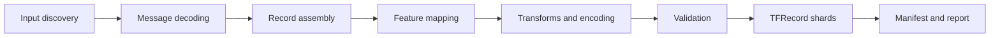

# MCAP To TFRecord Conversion Design

## Summary

The conversion pipeline should work for any MCAP or ROS log while still letting the user control the final training schema.

The current implementation already has useful pieces:

- `hephaes/src/hephaes/reader.py` reads ROS1 and ROS2 logs
- `hephaes/src/hephaes/converter.py` orchestrates conversion
- `hephaes/src/hephaes/mappers.py` resolves topic aliases
- `hephaes/src/hephaes/outputs/tfrecord_writer.py` writes TFRecord examples
- `hephaes/src/hephaes/manifest.py` writes dataset manifests

Those pieces are enough for generic export, but they are not enough for a training-ready dataset because the current output schema is still too implicit.

This design separates the converter into four explicit concerns:

- how to read MCAP topics and messages
- how to align and synchronize messages
- how to transform and encode values
- how to write TFRecord features

That separation gives us two things at once:

- support for arbitrary MCAP logs
- user control over the final output schema

## Design Goals

- Keep input handling generic and log-format aware.
- Make output schema explicit, versioned, and contract-checked.
- Let the user choose how records are assembled.
- Let the user choose how values are transformed and encoded.
- Produce TFRecord output that can be consumed directly by a training script.
- Preserve enough metadata to audit the conversion later.
- Keep the system extensible through declarative config and optional plugins.

## Non-Goals

- Do not infer labels automatically unless the user asks for that.
- Do not hard-code Doom-specific assumptions into the generic converter.
- Do not make TFRecord writer logic responsible for topic discovery or synchronization.
- Do not require a distributed pipeline before the local version is useful.

## Proposed Pipeline



Each stage owns one job and should not quietly absorb another stage’s responsibilities.

## Configuration Model

The converter should be driven by a declarative config file for most use cases.

The same config shape should also be usable from Python and from backend request payloads.

### Input Discovery

The input layer should support:

- MCAP file paths
- glob patterns
- recursive directory scans
- topic include patterns
- topic exclude patterns
- start and end time windows
- max message limits
- optional sampling rate limits

The converter should resolve the final input set before any message decoding starts.

### Message Decoding

The decoding layer should support:

- automatic ROS2 schema detection when the schema is available
- manual type hints per topic for unknown or custom messages
- fallback behavior on decode failure
- topic-level decode policies such as `skip`, `warn`, and `fail`

The decoder should normalize message payloads into a consistent in-memory structure that downstream stages can consume.

### Record Assembly

Record assembly should be trigger-driven instead of topic-union-driven.

The config should allow the user to choose a trigger topic, then join other topics onto each trigger record.

Supported sync policies should include:

- `nearest`
- `last-known-before`
- `exact-within-tolerance`

Each join should be able to set:

- a tolerance
- a staleness limit
- a required or optional flag

This is the key change that makes the output directly useful for training, because the record no longer depends on a generic “whatever message happened to arrive next” layout.

### Missing Data Policy

Missing data should be a first-class part of the schema, not an afterthought.

The config should support:

- fill with defaults
- forward-fill per topic
- drop the record if a required feature is missing
- emit presence flags for optional fields

Presence flags are important because they let the training script distinguish between “value is zero” and “value was unavailable.”

### Feature Mapping

Feature mapping should define the final TFRecord contract.

Each feature should be able to declare:

- output feature name
- source path, expressed as topic plus field path
- output dtype
- output shape or shape constraints
- required versus optional
- transform chain

The source path should be explicit enough to address nested fields such as `topic.buttons` or `topic.data`.

The output feature name should be what the training script reads, not what the source topic happened to be named.

### Transform And Encoding

The transform layer should support both image and numeric values.

Image transforms should include:

- channel conversion such as BGRA to RGB, BGR to RGB, and grayscale
- resize and crop
- normalization or raw passthrough
- encode format selection such as PNG, JPEG, or raw bytes

Numeric transforms should include:

- clamp
- scale
- cast
- thresholding
- one-hot and multi-hot expansion

Sequence handling should include:

- fixed-length pad and truncate
- ragged support when the downstream consumer can handle it

### Label Generation

Label generation should be explicit and separate from feature extraction.

The config should support:

- choosing which field becomes the label
- deriving labels from multiple source inputs
- class mapping tables
- single-label and multi-label output

The converter should not assume that every dataset uses the same label convention.

### Schema And Version Management

The output should carry a schema identity.

The schema should include:

- schema name
- schema version
- feature contract version
- optional dataset template name

The converter should save schema metadata alongside the output and optionally emit a manifest JSON with feature definitions and summary stats.

### Sharding And Output

The converter should support:

- multiple TFRecord shards
- GZIP or uncompressed output
- deterministic ordering
- seed-based reproducibility where randomization is used
- file naming templates

The sharding rules should be deterministic so that reruns are easy to compare.

### Quality Gates And Validation

Validation should happen before and during writing.

The converter should validate:

- dtype compatibility
- shape compatibility
- required feature presence
- label contract correctness

The converter should also produce:

- label distribution summary
- missing-topic rates
- bad-record budget enforcement

If the output does not satisfy the training contract, the run should fail fast.

### Dataset Splitting

The converter should optionally split the dataset into separate TFRecord sets.

Supported split strategies should include:

- time-based split
- random split
- deterministic split with a seed

The output should write each split as its own TFRecord set and carry split metadata in the manifest.

### Auditability

The conversion should always leave an audit trail.

That audit trail should include:

- conversion report with counts and dropped rows
- missing-topic rates
- sample preview mode
- dry-run validation mode
- validation results and error summaries

## Doom Compatibility Contract

The immediate training-script target is a Doom-compatible dataset.

For compatibility with the training script, the output records must contain:

- `image`: PNG bytes, RGB, decodable by `tf.image.decode_png`
- `buttons`: `int64` vector of length `15`

Recommended mapping rules for that preset:

- trigger topic: `/doom_image`
- join topic: `/joy`
- sync policy for `/joy`: `last-known-before`
- image pipeline: read raw BGRA bytes, convert BGRA to RGB, encode as PNG, write as `image`
- buttons pipeline: read `joy.buttons`, enforce length 15, cast to `int64`, fill missing values with 15 zeros, write as `buttons`

Optional metadata fields are fine, but they must not remove or rename the required `image` and `buttons` fields.

### Recommended Template

The converter should ship a built-in preset named `doom_ros_train_py_compatible`.

That preset should encode the exact contract above and should be usable as a starting point for custom variants.

## Config Example

```yaml
schema:
  name: doom_ros_train_py_compatible
  version: 1

input:
  paths:
    - data/**/*.mcap
  recursive: true
  include_topics:
    - /doom_image
    - /joy

decoding:
  topics:
    /doom_image:
      type_hint: custom_msgs/msg/RawImageBGRA
    /joy:
      type_hint: sensor_msgs/msg/Joy
  on_decode_failure: warn

assembly:
  trigger_topic: /doom_image
  joins:
    - topic: /joy
      sync_policy: last-known-before
      staleness_ns: 250000000
      required: true

features:
  image:
    source:
      topic: /doom_image
      field_path: data
    dtype: bytes
    required: true
    transforms:
      - image_color_convert:
          from: bgra
          to: rgb
      - image_encode:
          format: png
  buttons:
    source:
      topic: /joy
      field_path: buttons
    dtype: int64
    shape: [15]
    required: true
    missing: zeros
    transforms:
      - length:
          exact: 15
      - cast:
          dtype: int64

labels:
  primary: buttons

output:
  format: tfrecord
  compression: gzip
  shards: 8
  filename_template: "{split}-{shard:05d}-of-{num_shards:05d}.tfrecord"

validation:
  sample_n: 128
  fail_fast: true
  bad_record_budget: 0
  expected_features:
    - image
    - buttons
```

## Plugin Model

The default path should be declarative, but the design should allow custom hooks when the built-in transform set is not enough.

Supported extension points should include:

- custom transforms
- custom label generation
- custom validation checks

Plugins should be loaded explicitly and should not execute automatically from source data.

## Manifest And Report

The manifest should store enough information to reproduce and audit the conversion.

Recommended manifest fields:

- schema name and version
- resolved feature definitions
- source paths and source topics
- record counts
- dropped-record counts
- per-feature missing rates
- label distribution summary
- split assignments
- validation result summary
- preview sample info when preview mode is used

The manifest should stay alongside the output files.

## Current-State Mapping

The current code already provides useful base layers, and the new design should build on them instead of replacing them wholesale.

| Existing file | Current responsibility | New responsibility |
| --- | --- | --- |
| `hephaes/src/hephaes/reader.py` | ROS log reading and metadata | Source discovery and decoded message access |
| `hephaes/src/hephaes/converter.py` | Orchestration and resampling | Top-level conversion coordinator |
| `hephaes/src/hephaes/mappers.py` | Topic alias resolution | Compatibility layer for old mapping behavior |
| `hephaes/src/hephaes/outputs/tfrecord_writer.py` | TFRecord writing | Feature contract aware writing |
| `hephaes/src/hephaes/manifest.py` | Episode manifest writing | Schema, split, and validation metadata |
| `backend/app/schemas/conversions.py` | Backend request shape | User-facing conversion config surface |

## Acceptance Criteria

- A user can define a deterministic schema for a training job.
- The converter can produce a Doom-compatible TFRecord set without post-processing.
- Required features are validated before the full conversion runs.
- Missing data behavior is explicit and auditable.
- The manifest captures schema and quality metadata.
- The same schema logic can be used from Python, the backend API, and a future CLI.
